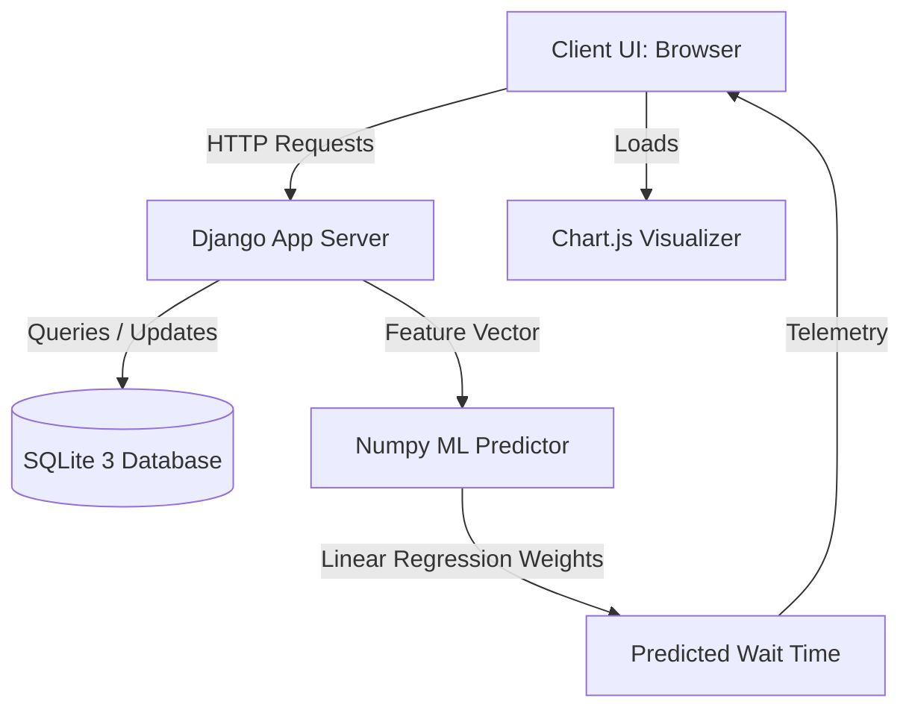

# Project Architecture — SmartQueue AI

This document provides a comprehensive overview of the design patterns, models, directory structure, and machine learning components inside the **SmartQueue AI** intelligent queue management system.

---

## 1. System Design & Technology Stack

SmartQueue AI is constructed as a monolithic web platform using:
*   **Backend Framework**: Django 6.x (Python-based)
*   **Database Engine**: SQLite 3 (relational structure)
*   **Mathematical/ML Core**: Numpy (custom multiple linear regression solver)
*   **Front-end Libraries**: Chart.js (CDN-integrated canvas charts), FontAwesome 6, Google Fonts (Inter & Outfit)
*   **Styling Theme**: Custom glassmorphism dark-neon system (Vanilla CSS)



---

## 2. Django Directory Structure

The repository is structured as follows:

```
smartQueue/
│
├── backend/
│   ├── SmartQueue/              # Django Main Project Config
│   │   ├── settings.py          # Relational Database, Middleware, Context Processors
│   │   └── urls.py              # Root Routing Tables
│   │
│   ├── accounts/                # Authentication App
│   │   ├── views.py             # User Register, Login, Logout views
│   │   └── urls.py              # Accounts Routing URLs
│   │
│   ├── queue_system/            # Operations & Queue App
│   │   ├── ai_predictor.py      # Numpy ML Predictor Core
│   │   ├── models.py            # Appointment models
│   │   ├── forms.py             # Appointment registration forms
│   │   ├── urls.py              # Queue-specific URLs
│   │   └── views.py             # Dashboards, Bookings, calling queue states
│   │
│   └── templates/               # Global HTML Template Layouts
│       ├── accounts/
│       │   ├── base.html        # Glass navbar, footer, dynamic alerts, and Chatbot
│       │   ├── dashboard.html   # Main panel + Chart.js visual canvases
│       │   └── home.html        # Premium SaaS homepage + CSS Orbit Illustration
│       └── queue_system/
│           ├── book.html        # Form select + JS recommended slots
│           └── admin_queue.html # Operations token caller list
```

---

## 3. Database Schema

The core operations run on the `Appointment` model:

| Field Name | Type | Description |
| :--- | :--- | :--- |
| `id` | `BigAutoField` (Primary Key) | Auto-incrementing identifier |
| `user` | `ForeignKey(User)` | Cascaded reference to Django User |
| `service` | `CharField` | Choices: Hospital, Bank, University, Government, Service Center |
| `appointment_date` | `DateField` | Day of booking visit |
| `token_number` | `CharField` | Unique daily ticket token (e.g. `A-001`, `A-002`) |
| `status` | `CharField` | Choices: Waiting, Serving, Completed (Default: Waiting) |
| `created_at` | `DateTimeField` | Auto-added record timestamp |

---

## 4. Machine Learning Wait Time Regressor

Rather than using basic hardcoded timers, SmartQueue AI uses a custom Multiple Linear Regression model built directly on **Numpy** to solve the normal equations:

$$\beta = (X^T X)^{-1} X^T Y$$

### Features Vector ($X$)
The model takes the following inputs:
1.  **Bias Intercept** ($x_0 = 1.0$)
2.  **Queue Size** ($x_1$): Number of waiting customers currently ahead in line.
3.  **Hour of Day** ($x_2$): Time of check-in (9 AM - 5 PM).
4.  **Service Categorical (One-hot encoded)** ($x_3 \dots x_7$): Hospital, Bank, University, Government, Service Center.

### Dynamic Training
On initialization, the module generates 150 historical simulation entries containing typical queue parameters and actual wait times perturbed by Gaussian noise, then trains the coefficients vector ($\beta$). The resulting weights model wait time calculations accurately.

---

## 5. Front-End Integrations

### Smart Slot Recommendations
*   When booking, `book_appointment` calculates the predicted wait time for each hour of the business day.
*   It packages this into a JSON structure, and an inline JS selector renders the top 3 optimal time slots with the lowest predicted waits directly on the booking page.

### AI Analytics Charts
*   `dashboard_view` extracts real-time database counts.
*   Passes distribution maps to Chart.js canvases to draw the active doughnut load chart and hourly wait time trends.

### Assistive Chatbot
*   A client-side chat panel handles inquiries using natural keywords to guide users through wait calculations, token listings, booking steps, and operational access points.
